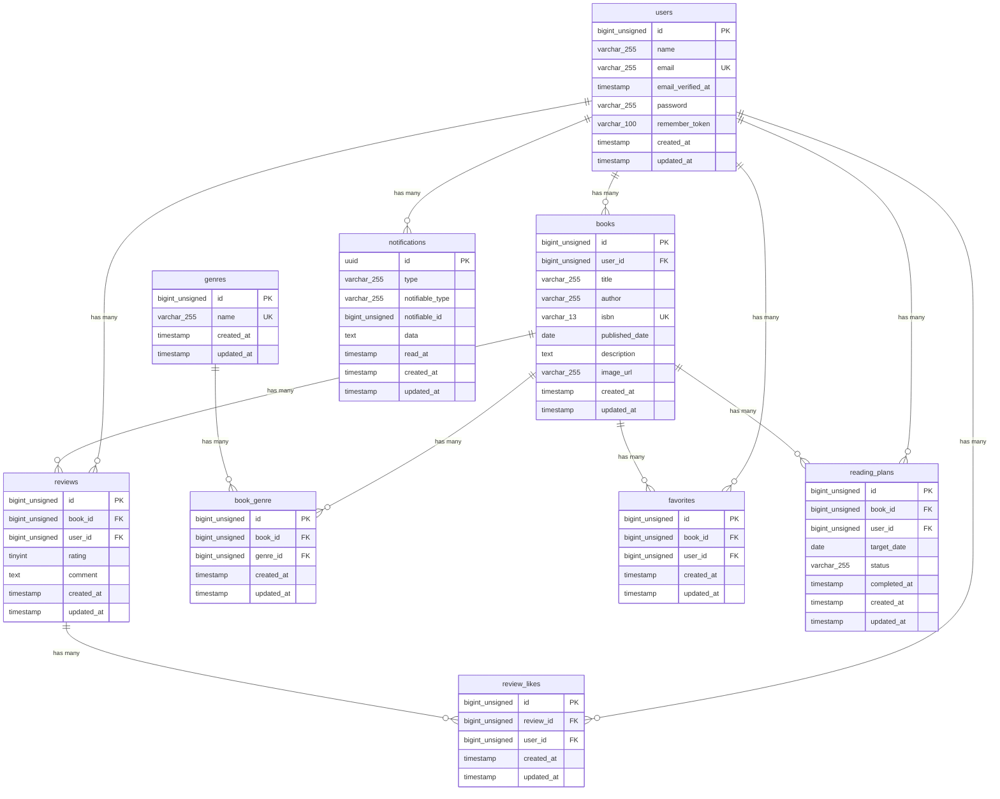

# COACHTECH 書籍レビューアプリ BookShelf

本システムは、書籍レビューアプリケーション「BookShelf」です。
ユーザーは書籍を登録・閲覧し、レビューの投稿やお気に入り登録ができます。
ジャンルによる分類やレビューへのいいね機能、平均評価に基づくランキング機能も備えています。
外部アプリケーション向けの公開API（JSON）も提供します。

## 作成者

氏名 赤井翔太

## 使用技術

- PHP 8.5
- Laravel 10.x
- MySQL 8.4
- Nginx
- Docker / Docker Compose / Laravel Sail
- Vite / Tailwind CSS 3.4
- Laravel Fortify（認証）
- phpMyAdmin

## ER図



### 制約

- reviews: UNIQUE(book_id, user_id)
- favorites: UNIQUE(book_id, user_id)
- review_likes: UNIQUE(review_id, user_id)
- book_genre: UNIQUE(book_id, genre_id)
- reading_plans: UNIQUE(book_id, user_id)

## 開発環境URL

http://localhost

## 動作環境

- Docker
- Docker Compose

※ Windowsの場合はWSL2の利用を推奨します。

## 環境構築手順

1. **リポジトリをクローン**

    ```bash
    git clone https://github.com/akasho326/bookshelf-app.git
    ```

2. **.envファイルの準備**

    `.env.example` をコピーして `.env` を作成します。

    ```bash
    cp .env.example .env
    ```

    `.env` ファイル内の以下のDB接続情報を確認・設定します。`.env.example` のデフォルト値はSail向けではないため、以下のように変更してください。

    ```ini
    DB_CONNECTION=mysql
    DB_HOST=mysql
    DB_PORT=3306
    DB_DATABASE=laravel
    DB_USERNAME=sail
    DB_PASSWORD=password
    ```

3. **Composer依存パッケージのインストール**

    プロジェクトの初回セットアップ時は、`vendor` ディレクトリが存在しないため `sail` コマンドを使用できません。
    以下のDockerコマンドを実行して、コンテナ内で `composer install` を実行します。

    ```bash
    docker run --rm \
        -u "$(id -u):$(id -g)" \
        -v "$(pwd):/var/www/html" \
        -w /var/www/html \
        laravelsail/php85-composer:latest \
        composer install --ignore-platform-reqs
    ```

4. **Laravel Sailの起動**

    以下のコマンドでDockerコンテナを起動します。

    ```bash
    ./vendor/bin/sail up -d
    ```

    > **エイリアスの設定（推奨）**
    >
    > 毎回 `./vendor/bin/sail` と入力するのは手間なので、エイリアスを設定すると便利です。
    >
    > ```bash
    > alias sail='[ -f sail ] && bash sail || bash vendor/bin/sail'
    > ```

5. **アプリケーションキーの生成**

    ```bash
    sail artisan key:generate
    ```

6. **データベースのマイグレーションと初期データ投入**

    以下のコマンドでテーブルを作成し、ダミーデータを投入します。

    ```bash
    sail artisan migrate:fresh --seed
    ```
    このコマンドの入力後、コンテナ内にデータが残っており、エラーが生じているケースなどがあります。
    その場合は、以下のコマンドを順に実行して各コンテナを再起動して下さい。
    ```Bash
    sail down -v
    sail up -d
    sail artisan migrate:fresh --seed
    ```
    MySQLコンテナの起動には少し時間がかかる場合があります。

7. **フロントエンドのビルド**

    ```bash
    sail npm install
    sail npm run dev
    ```
    Tailwind CSSを使用しています。
    開発時は `npm run dev` でViteサーバーを起動した状態にしてください。

8. **アプリケーションへのアクセス**

    ブラウザで [http://localhost](http://localhost) にアクセスします。

## テスト実行

```bash
sail artisan test
```

カバレッジ付きで実行する場合:

```bash
sail artisan test --coverage
```

## 機能一覧

- ユーザー認証（登録、ログイン、ログアウト）
- 書籍登録・一覧表示
- 書籍詳細表示・更新・削除
- ジャンル作成・一覧表示
- ジャンル詳細・更新・削除
- レビュー投稿・更新・削除
- レビューへのいいね追加
- 書籍お気に入り追加・一覧表示
- 書籍ランキングTOP10一覧表示（レビュー平均評価順）
- 公開API（書籍CRUD）

## APIエンドポイント一覧

認証不要の公開APIです。全エンドポイントは `/api/v1` プレフィックス配下に定義されています。

| HTTPメソッド | URI | 概要 |
|---|---|---|
| GET | /api/v1/books | 書籍一覧（キーワード検索・ジャンル絞り込み・ページネーション付き） |
| GET | /api/v1/books/{book} | 書籍詳細（ジャンル・レビュー・評価含む） |
| POST | /api/v1/books | 書籍新規作成 |
| PUT | /api/v1/books/{book} | 書籍更新 |
| DELETE | /api/v1/books/{book} | 書籍削除 |

## テスト

### Unitテスト

- Book
- Genre
- Favorite
- Review
- ReviewLike
- User

### Featureテスト

- 書籍CRUD
- ジャンルCRUD
- レビューCRUD
- お気に入り機能
- レビューいいね機能
- ランキング機能
- API（検索・ページネーション含む）
- 認証・認可
